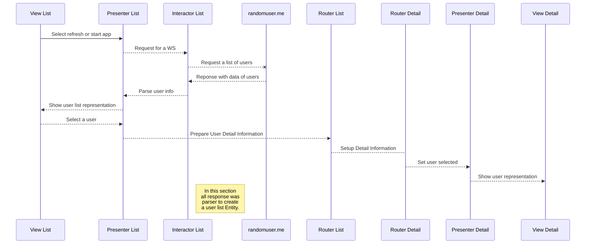

# Welcome to RandomUser

This app is a small test of https://randomuser.me/api where you can see a list of 20 users and details of them, you can search users in this list of people by name or gender. Once you select an user can view a detailed information about their location, make a phone call (if you have a physical device) or send them an email (like in the phone call only if you have a physical device).

## Architecture
The app was written in swift and have some libraries from Cocoapods
For this implementation I use only VIPER architecture and don't have storyboard, all UI was written programmatically excepted by launch screen, this decision was made to create Unit testing and UI testing easily.

## UML diagrams

The mainly flow of the app is:

